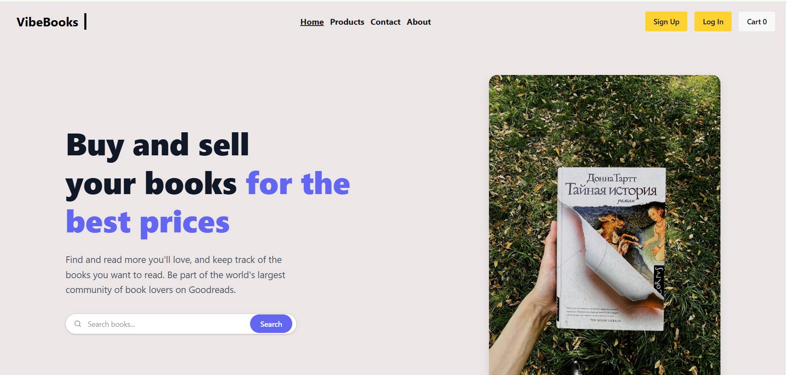
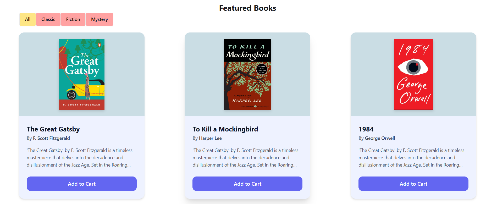

# 📚 VibeBooks - Mini Book Store Practise Project


A fully responsive, frontend-focused mini practice project for a modern online bookstore. Built to practice React state management, component architecture, and dynamic UI rendering.

🚀 **Live Demo:** [View Project on Netlify](https://regal-paprenjak-efd3fd.netlify.app/)

## ✨ Key Features

- **Category-Wise Filtering:** Users can dynamically sort and view books based on specific categories (e.g., Fiction, Classic, Mystery) without reloading the page.
- **Add to Cart Functionality:** Interactive cart system that tracks user selections and updates the cart counter in the navigation bar.
- **Responsive UI/UX:** Clean, modern, and user-friendly interface that works seamlessly across desktop, tablet, and mobile devices.
- **Dynamic Rendering:** Data is fetched and rendered dynamically using React's latest hooks (`useState`, `Suspense`, `use`).

## 🛠️ Tech Stack

- **Frontend Framework:** React.js (Vite)
- **Styling:** Tailwind CSS & DaisyUI (for rapid, modern UI components)
- **Deployment:** Netlify

## 💻 Run Locally

To get a local copy up and running, follow these simple steps:

1. **Clone the repository:**
   ```bash
   git clone [https://github.com/Firoz671/book-store-web.git](https://github.com/Firoz671/book-store-web.git)
   ```
2. **Preview**
   
   
